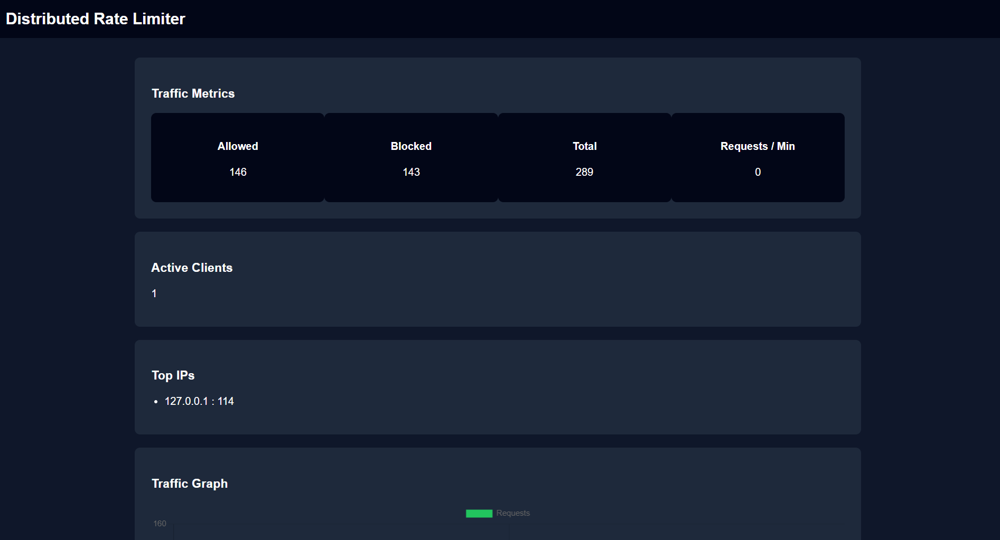
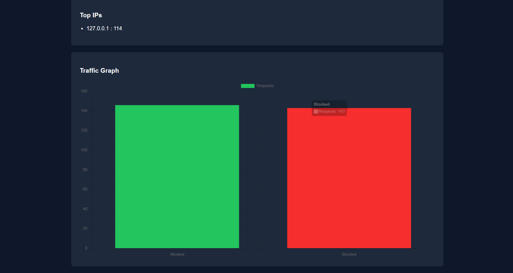

# Distributed Rate Limiter

A production-style **distributed API rate limiting system** built with FastAPI and Redis, featuring real-time monitoring, traffic analytics, and multiple rate limiting algorithms.

This project demonstrates how modern backend systems protect APIs from abuse, enforce fair usage policies, and maintain system stability under high traffic.

---

# Live Deployment

- API Service

https://distributed-rate-limiter-a7yr.onrender.com/

- Monitoring Dashboard

https://distributed-rate-limiter-a7yr.onrender.com/dashboard

- Repository

https://github.com/Prafful7601/distributed-rate-limiter

---

# System Architecture

The system uses **FastAPI middleware to intercept requests** and enforce rate limits using Redis as a shared state store.

Client Requests
│
▼
FastAPI Application
│
Rate Limiter Middleware
│
├── Token Bucket Limiter
├── Fixed Window Limiter
└── Sliding Window Limiter
│
▼
Redis (Distributed State Store)
│
▼
Traffic Analytics + Dashboard

Redis allows **multiple API servers to share rate limit state**, enabling horizontal scaling.

---

# Monitoring Dashboard

The project includes a **real-time monitoring dashboard** that visualizes API traffic and rate limiting behavior.

Dashboard URL
- https://distributed-rate-limiter-a7yr.onrender.com/dashboard

Dashboard displays:

- Allowed Requests
- Blocked Requests
- Total Requests
- Requests Per Minute
- Active Clients
- Top IP Addresses
- Traffic Graph

---

# Dashboard Preview

---

# Features

## Distributed Rate Limiting

All rate limit state is stored in Redis, allowing multiple API servers to enforce the same limits.

API Instance 1
API Instance 2
API Instance 3
│
▼
Redis Shared State

This architecture supports horizontal scaling.

---

## Multiple Rate Limiting Algorithms

The system supports several commonly used algorithms.

### Token Bucket

- Allows bursts of traffic
- Tokens refill gradually
- Smooth traffic shaping

Example configuration:
capacity = 10 tokens
refill_rate = 0.2 tokens/sec

---

### Fixed Window
Counts requests within a time window
Resets after expiration

---

### Sliding Window
More accurate rate limiting
Prevents burst spikes at window edges

Algorithms can be switched dynamically.

Example:
/api/data?algorithm=token
/api/data?algorithm=fixed
/api/data?algorithm=sliding

---

# API Key Based Rate Limiting

Clients can use API keys to receive independent rate limits.

Example request:
/api/data?api_key=user1

Each API key has its own request quota.

---

# API Usage

Basic request

GET /api/data

Example response:
{
"message": "Request successful"
}

---

Switch algorithm

GET /api/data?algorithm=sliding

---

Use API key

GET /api/data?api_key=user1

---

# Analytics Endpoints

Traffic statistics

GET /stats

Example response:

{
"allowed": 120,
"blocked": 32,
"total": 152,
"requests_per_minute": 28
}

---

Top IP addresses

GET /top_ips

---

Active clients

GET /active_clients

---

System configuration

GET /system

---

# Load Testing

This project includes load testing using **Locust**.

Run Locust

locust -f load_test.py

Open Locust UI:
http://localhost:8089

Example test configuration:
Users: 100
Spawn Rate: 10

This simulates burst traffic and demonstrates the limiter blocking excessive requests.

---

# Run Locally

Clone repository

git clone https://github.com/Prafful7601/distributed-rate-limiter

cd distributed-rate-limiter

Install dependencies

pip install -r requirements.txt

Start Redis

docker run -p 6379:6379 redis

Start API server

uvicorn app.main:app --reload

Open dashboard:
http://localhost:8000/dashboard

---

# Project Structure

distributed-rate-limiter

app/
│
├── main.py
│
├── limiter/
│ ├── redis_limiter.py
│ ├── fixed_window_limiter.py
│ └── sliding_window_limiter.py
│
├── middleware/
│ └── rate_limiter.py
│
└── storage/
└── redis_client.py

dashboard/
└── index.html

load_test.py
Dockerfile
docker-compose.yml
README.md

---

# Tech Stack

Backend:
- Python
- FastAPI
- Redis

Infrastructure:
- Docker
- Render Cloud

Frontend:
- HTML
- CSS
- JavaScript
- Chart.js

Observability:
- Redis analytics
- Live monitoring dashboard
- Traffic metrics

---

# Learning Outcomes

This project demonstrates knowledge of:

- Distributed systems design
- Rate limiting algorithms
- Redis data structures
- Middleware architecture
- API observability
- Cloud deployment

---

# Author

Prafful Gupta
Backend developer focused on distributed systems and scalable backend infrastructure.

LinkedIn
https://www.linkedin.com/in/prafful-gupta-67a3b0203/

© Prafful Gupta